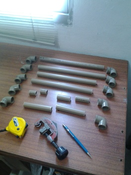
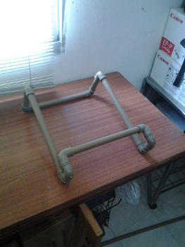
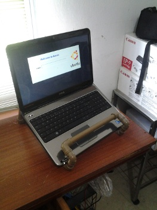

DIY: Suporte para notebook com cano de PVC

.. author:: default
.. categories:: none
.. tags:: none
.. coments::

Um suporte para notebook é muito útil para quem trabalha o dia todo no
computador e quer mantê-lo em uma posição mais confortável com a tela na
altura dos olhos. Adicionando também um teclado e mouse externos de
qualidade, temos um aumento grande no conforto (pelo menos eu acho bem
mais confortável trabalhar assim).

Existem diversas opções no mercado, custando a partir de R$30
(pesquisando no MercadoLivre), mas como eu queria economizar encontrei
alguns projetos de suportes feitos com canos de PVC e resolvi fazer o
meu. Com menos de R$7 comprei os materiais necessários (cano e
cotovelos), peguei emprestado um cortador de cano de PVC (você pode usar
uma `serrinha amarela`_ no lugar, mas dá um pouquinho mais de trabalho 
para cortar) e em menos de 30 minutos meu suporte estava pronto!

Materiais Necessários
^^^^^^^^^^^^^^^^^^^^^

* 1 cano de PVC de 20mm
* 10 cotovelos de 90 graus

Como fazer
^^^^^^^^^^
Corte o cano de PVC com as seguintes medidas:

* 2 partes de 29cm
* 2 partes de 25cm
* 2 partes de 10cm
* 2 partes de 5cm
* 2 partes de 2.5cm

Eu calculei essas medidas com base no meu notebook que tem 38cm x 26cm.
Se seu notebook for menor (ou maior), você precisa adaptar as medidas.
Também cortei ele de modo a parte mais alta do suporte ficar a cerca de
10cm de altura.

Montagem
^^^^^^^^

A montagem é bem simples. Observando a imagem deve ficar fácil de
entender onde cada peça se encaixa. Prenda os canos bem forte dentro dos
cotovelos. Não é necessário usar cola, os canos se fixam muito bem
sozinhos.

|Suporte montado - 1| |Suporte montado - 2|

Cheguei a testar em um pedaço de cano que sobrou a pintura usando tinta
spray. Funciona, mas tem que tomar cuidado de não passar tinta demais,
senão forma bolhas e a tinta escorre. O melhor é passar bem rápido o
spray uma vez, deixando a tinta secar e repetir esse processo até
conseguir que a cor fique uniforme.

Mas no fim resolvi deixar ele na cor "natural" de cano de PVC :-) Talvez
um próximo (já fizeram sugestões de como fazer ele ter ajuste de altura)
eu faça ele colorido.

.. _serrinha amarela: http://www.copaautopecas.com.br/index.php?productID=974
